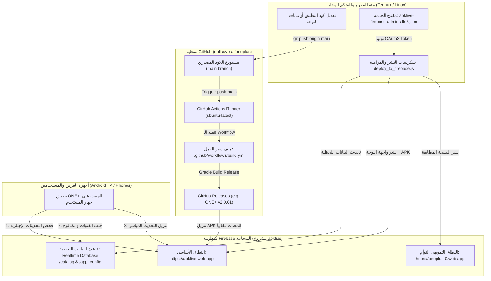

# الدليل الشامل المطور لهندسة بناء وتوزيع ONE+ v2.0 وإدارة أسرار GitHub Actions ولوحة التحكم السحابية (Firebase Cloud)

**المسار المرجعي في النظام:** `/storage/emulated/0/Filterlanguage/GITHUB_ACTIONS_BUILD_AND_SECRETS_GUIDE.md`  
**تاريخ الإصدار الأحدث:** 2026-10-09 (النسخة المحدثة الشاملة v2.0 - ترقية خطوط البناء السحابية ونظام Firebase المتكامل)  
**الموضوع:** أتمتة خطوط بناء تطبيقات أندرويد (CI/CD Pipeline)، إدارة المفاتيح والتوكنات، تكامل Firebase Admin SDK، إدارة لوحة التحكم السحابية ونطاقات الاستضافة المزدوجة، ونظام التحديثات التلقائية.

---

## 📑 الفهرس العام
1. [نظرة عامة على بنية النظام السحابي لمنظومة ONE+](#1-نظرة-عامة-على-بنية-النظام-السحابي-لمنظومة-one)
2. [المخطط الهيكلي الشامل لدورة البناء ولوحة التحكم السحابية (End-to-End Architecture)](#2-المخطط-الهيكلي-الشامل-لدورة-البناء-ولوحة-التحكم-السحابية)
3. [دليل التوكنات، المفاتيح، والأسرار المعتمدة (Comprehensive Secrets & Tokens)](#3-دليل-التوكنات-المفاتيح-والأسرار-المعتمدة)
   - [أولاً: مفتاح الخدمة السحابي Firebase Admin SDK](#أولا-مفتاح-الخدمة-السحابي-firebase-admin-sdk-apklive)
   - [ثانياً: التوكن الداخلي التلقائي GITHUB_TOKEN](#ثانيا-التوكن-الداخلي-التلقائي-github_token)
   - [ثالثاً: التوكن الشخصي المعتمد Personal Access Token (PAT)](#ثالثا-التوكن-الشخصي-المعتمد-personal-access-token-pat)
   - [رابعاً: مفاتيح التوقيع الرقمي للأندرويد (Keystore Secrets)](#رابعا-مفاتيح-التوقيع-الرقمي-للأندرويد-keystore-secrets)
   - [خامساً: بيانات اعتماد وحماية لوحة التحكم (Panel Auth)](#خامسا-بيانات-اعتماد-وحماية-لوحة-التحكم-panel-auth)
4. [معمارية لوحة التحكم السحابية (ONE+ Cloud Control Panel & Dashboard)](#4-معمارية-لوحة-التحكم-السحابية-one-cloud-control-panel)
   - [النطاقات السحابية المزدوجة (Dual Hosting Sites)](#النطاقات-السحابية-المزدوجة-dual-hosting-sites)
   - [قاعدة البيانات اللحظية (Firebase Realtime Database)](#قاعدة-البيانات-اللحظية-firebase-realtime-database)
   - [نظام التحكم بالتحديثات والتوافقية (app_config.json)](#نظام-التحكم-بالتحديثات-والتوافقية-app_configjson)
   - [كتالوج المحتوى المصفى (catalog.json & Moviebox)](#كتالوج-المحتوى-المصفى-catalogjson--moviebox)
5. [أدوات وسكريبتات النشر والمزامنة السحابية الذاتية](#5-أدوات-وسكريبتات-النشر-والمزامنة-السحابية-الذاتية)
   - [سكريبت النشر المباشر عبر REST API (deploy_to_firebase.js)](#سكريبت-النشر-المباشر-عبر-rest-api-deploy_to_firebasejs)
   - [سكريبت مزامنة القنوات والكتالوج (sync_channels_and_deploy.js)](#سكريبت-مزامنة-القنوات-والكتالوج-sync_channels_and_deployjs)
6. [تشريح ملف سير العمل المعتمد (.github/workflows/build.yml)](#6-تشريح-ملف-سير-العمل-المعتمد-githubworkflowsbuildyml)
   - [النسخة القياسية الحالية (ONE+ v2.0 Build & Release)](#النسخة-القياسية-الحالية-one-v20-build--release)
   - [النسخة الموسعة المتكاملة (APK Build + Cloud Panel Deploy)](#النسخة-الموسعة-المتكاملة-apk-build--cloud-panel-deploy)
7. [أوامر الإدارة والتشغيل السريع عبر Terminal و GitHub CLI (gh)](#7-أوامر-الإدارة-والتشغيل-السريع-عبر-terminal-و-github-cli-gh)
8. [أفضل الممارسات الأمنية، الصيانة، وحل المشكلات](#8-أفضل-الممارسات-الأمنية-الصيانة-وحل-المشكلات)

---

## 1. نظرة عامة على بنية النظام السحابي لمنظومة ONE+

تعتمد منظومة **ONE+ v2.0** على تكامل سحابي كامل بين ثلاث ركائز هندسية أساسية:
1. **تطبيق أندرويد الأصلي (Native Android App):** مبني بتقنيات Jetpack Compose، Room Database للتخزين المحلي، وExoPlayer مع دعم الترجمات العربية والدمج الديناميكي.
2. **محرك البناء السحابي (GitHub Actions CI/CD):** يتولى سحب الكود البرمجي، وتجهيز بيئات JDK 17 و Gradle، وتجميع ملفات الحزمة `OnePlus.apk` وتوقيعها، ونشرها كإصدارات رسمية دائمة في **GitHub Releases**.
3. **لوحة التحكم السحابية المزدوجة وقاعدة بيانات Firebase (Cloud Control Panel & RTDB):** توفر إدارة لحظية للقنوات، المباريات، الأفلام، والتحكم بإصدارات التطبيق عبر السحابة وتوزيع ملفات التحديث عبر نطاقات CDN عالمية سريعة.

---

## 2. المخطط الهيكلي الشامل لدورة البناء ولوحة التحكم السحابية



---

## 3. دليل التوكنات، المفاتيح، والأسرار المعتمدة

لضمان عمل كافة خطوط البناء والمزامنة بأعلى درجات الأمان ودون توقف، يعتمد النظام على المفاتيح التالية:

---

### أولاً: مفتاح الخدمة السحابي Firebase Admin SDK (`apklive`)

هو المفتاح الإداري المسؤول عن صلاحيات الوصول البرمجية الكاملة لمشروع Firebase بما يتيح نشر الاستضافة (Hosting) وتحديث قاعدة البيانات (Realtime Database) دون الحاجة لجلسة تفاعلية (`firebase login`).

* **اسم الملف المعتمد:** [`apklive-firebase-adminsdk-rfuda-fe97200747.json`](file:///storage/emulated/0/Filterlanguage/apklive-firebase-adminsdk-rfuda-fe97200747.json)
* **المسار الكامل في بيئة العمل:** `/storage/emulated/0/Filterlanguage/apklive-firebase-adminsdk-rfuda-fe97200747.json`
* **البيانات التفصيلية للمفتاح:**
  * **معرّف المشروع (Project ID):** `apklive`
  * **البريد الخدمي (Client Email):** `firebase-adminsdk-rfuda@apklive.iam.gserviceaccount.com`
  * **معرّف المفتاح الخاص (Private Key ID):** `fe972007477d2ad2f6d5ff9a77171ea81432bea4`
  * **خوارزمية التوقيع (Algorithm):** `RS256` (RSA-SHA256)
  * **نطاقات الصلاحيات (Scopes):**
    * `https://www.googleapis.com/auth/cloud-platform`
    * `https://www.googleapis.com/auth/firebase`
    * `https://www.googleapis.com/auth/userinfo.email`

#### 🔐 كيفية استخدام المفتاح في الأتمتة واستخراج التوكن برمجياً (JWT Flow):
يقوم كود Node.js المعتمد في المنظومة بتوليد توكن مؤقت صالح لمدة ساعة عبر الخطوات الرياضية التالية:
1. ترويسة التشفير: `{"alg":"RS256","typ":"JWT"}` مشفرة Base64URL.
2. حمولة المطالبة (Claims): تحتوي على `iss` (البريد الخدمي)، الصلاحيات، ومدة الصلاحية.
3. التوقيع الرقمي: توقيع البيانات السابقة باستخدام المفتاح الخاص `private_key` وحساب التوقيع بـ RSA-SHA256.
4. إرسال طلب إلى: `https://oauth2.googleapis.com/token` بطلب المنحة `urn:ietf:params:oauth:grant-type:jwt-bearer`.
5. استلام `access_token` صالح لإجراء كافة العمليات السحابية فوراً.

#### 📦 حفظ المفتاح في GitHub Secrets (لأتمتة النشر السحابي داخل الـ Actions):
1. تحويل ملف المفتاح إلى نص مشفر:
   ```bash
   base64 -w 0 /storage/emulated/0/Filterlanguage/apklive-firebase-adminsdk-rfuda-fe97200747.json > fb_key_base64.txt
   ```
2. إضافة السر في مستودع GitHub (`Settings` ➔ `Secrets and variables` ➔ `Actions`):
   * اسم السر: `FIREBASE_ADMIN_KEY_BASE64`
   * القيمة: محتوى ملف `fb_key_base64.txt`.

---

### ثانياً: التوكن الداخلي التلقائي `GITHUB_TOKEN`

توكن يتم توليده تلقائياً من سيرفرات GitHub لكل دورة بناء جديدة داخل الـ Runner.

* **الاستدعاء داخل الـ Workflow:**
  ```yaml
  env:
    GITHUB_TOKEN: ${{ secrets.GITHUB_TOKEN }}
  ```
* **الأذونات المطلوبة في ملف `.github/workflows/build.yml`:**
  لكي يتمكن من إنشاء الإصدارات في الـ Releases ورفع ملف الـ APK:
  ```yaml
  permissions:
    contents: write
  ```

---

### ثالثاً: التوكن الشخصي المعتمد Personal Access Token (PAT)

يُستخدم للتحكم وإدارة المستودعات من سطر الأوامر (Termux و Git و GitHub CLI `gh`) دون طلب كلمة المرور في كل عملية دفع أو سحب.

* **قيمة التوكن المحفوظة محلياً:**  
  `ghp_bcjj********************************sGIH` (مخزن بأمان داخل `~/.config/gh/hosts.yml`)
* **الحساب المالك:** `nullsave-ai`
* **البريد المرتبط:** `nullsave-ai@users.noreply.github.com`
* **المستودع الرئيسي:** `https://github.com/nullsave-ai/oneplus.git`
* **ملف التهيئة المحلي في Termux:** [`~/.config/gh/hosts.yml`](file:///data/data/com.termux/files/home/.config/gh/hosts.yml)
* **الصلاحيات الشاملة الممنوحة:** `repo`, `workflow`, `write:packages`, `delete_repo`, `admin:org`, `admin:public_key`, `notifications`, `gist`.

#### 💻 أوامر الاستخدام الفوري للتوكن:
1. **في عمليات Git المباشرة (باستخدام التوكن المحفوظ أو الـ Credential Helper):**
   ```bash
   git push origin main
   # أو عبر استدعاء التوكن المحفوظ ديناميكياً:
   # git push https://nullsave-ai:$(gh auth token)@github.com/nullsave-ai/oneplus.git main
   ```
2. **في طلبات API لجلب أحدث الإصدارات وسجلات البناء:**
   ```bash
   curl -H "Authorization: token $(gh auth token)" \
     "https://api.github.com/repos/nullsave-ai/oneplus/releases/latest"
   ```

---

### رابعاً: مفاتيح التوقيع الرقمي للأندرويد (Keystore Secrets)

تُستخدم لإنتاج حزمة Release APK موقعة بشهادة رسمية، مما يسمح بتحديث التطبيق فوق الإصدار السابق على تلفزيونات وهواتف المستخدمين دون حدوث تعارض في التوقيع (`Signature Mismatch`):

| اسم السر في GitHub Secrets | الوصف التقني | الحالة |
| :--- | :--- | :--- |
| `KEYSTORE_BASE64` | محتويات ملف مفتاح الأندرويد (`.jks`) مشفرة Base64 | معتمد للأتمتة السحابية |
| `KEY_ALIAS` | اسم المفتاح الداخلي داخل الحاوية | المعرّف المخصص للتطبيق |
| `KEY_PASSWORD` | كلمة سر المفتاح الداخلي | مشفرة في Secrets |
| `KEYSTORE_PASSWORD` | كلمة سر حاوية الـ Keystore بالكامل | مشفرة في Secrets |

---

### خامساً: بيانات اعتماد وحماية لوحة التحكم (Panel Auth)

* **كلمة مرور مدير اللوحة (Master Admin Password):**  
  `oneplus2026`
* **أماكن الربط والتطبيق في الكود:**
  1. ملف الجافاسكريبت للوحة السحابية: `const AUTH_PASS = "oneplus2026";` داخل [`web-panel/public/index.html`](file:///data/data/com.termux/files/home/web-panel/public/index.html).
  2. ملف إعدادات الاستضافة المحلية والـ PHP: `define('PASSWORD', 'oneplus2026');` داخل [`panel/config.php`](file:///data/data/com.termux/files/home/oneplus-repo/panel/config.php).
  3. ملف توثيق الاستضافات: `"panel_password": "oneplus2026"` داخل [`firebase_sites.json`](file:///storage/emulated/0/Filterlanguage/firebase_sites.json).

---

## 4. معمارية لوحة التحكم السحابية (ONE+ Cloud Control Panel)

تعتبر لوحة التحكم العقل المدبر لتطبيق ONE+، حيث تم تطويرها لتعمل كواجهة ويب حديثة متكاملة على شبكة توزيع محتوى CDN عالمية فائقة السرعة مع حماية كاملة.

### النطاقات السحابية المزدوجة (Dual Hosting Sites)

تم ربط وضبط موقعين سحابيين متزامنين على نفس مشروع Firebase (`apklive`) لضمان استمرارية الخدمة بنسبة 100%:
1. **النطاق الأساسي (Primary Site):**  
   🌐 `https://apklive.web.app` (البديل: `https://apklive.firebaseapp.com`)  
   الواجهة الرئيسية للإدارة وتوزيع ملفات التحديث `OnePlus.apk`.
2. **النطاق التمويهي التوأم (Mirror / Camouflage Site):**  
   🌐 `https://oneplus-0.web.app` (البديل: `https://oneplus-0.firebaseapp.com`)  
   نطاق إضافي مطابق تماماً يستقبل نفس التحديثات في نفس اللحظة عبر سكريبت النشر الموحد.

### إعدادات الرؤوس وتوجيه المتصفحات (`firebase.json`):
يتم إرسال ترويسات خاصة تمنع مشاكل الكاش وتسمح بالاتصال من أي منصة:
* `Access-Control-Allow-Origin: *` (سماح كامل بطلبات CORS لتطبيق أندرويد).
* `Cache-Control: no-cache, no-store, must-revalidate` (ضمان وصول أحدث نسخة من القنوات والملفات للمستخدمين فور نشرها).

### قاعدة البيانات اللحظية (Firebase Realtime Database)
* **رابط قاعدة البيانات:** `https://apklive-default-rtdb.firebaseio.com`
* **الفروع الأساسية:**
  * `/catalog`: يحتوي على كافة القنوات الرياضية، الإخبارية، والترفيهية، وأقسام المسلسلات والأفلام.
  * `/app_config`: يحتوي على حالة التطبيق وإعدادات التحديث.

### نظام التحكم بالتحديثات والتوافقية (`app_config.json`)
يقرأ التطبيق هذا الملف عند كل إقلاع لاتخاذ قرار التحديث:
```json
{
  "force_update": false,
  "latest_version_code": 61,
  "min_version_code": 1,
  "update_message": "يرجى تنزيل الإصدار الأحدث من تطبيق ONE+ لمتابعة المشاهدة بأعلى دقة وثبات وبدون انقطاع.",
  "update_title": "تحديث جديد متوفر",
  "update_url": "https://apklive.web.app"
}
```
* في حال تفعيل `"force_update": true` ووجود إصدار قديم لدى المستخدم، يقوم التطبيق بإغلاق الشاشة الرئيسية وعرض نافذة التحديث الإجباري لتحميل الحزمة الجديدة مباشرة من الرابط السحابي.

### كتالوج المحتوى المصفى (`catalog.json` & Moviebox)
يتم تحديث الكتالوج وتصفيته عبر نظام معالجة ذكي يزيل أي محتوى غير لائق (+18) ويضمن عمل الروابط المباشرة بأعلى جودة وثبات.

---

## 5. أدوات وسكريبتات النشر والمزامنة السحابية الذاتية

تعتمد المنظومة على سكريبتات Node.js مخصصة تستخدم Firebase Admin SDK ومكتبات Node.js القياسية (`crypto`, `zlib`, `fetch`) لنشر الملفات دون الحاجة لحزم خارجية ثقيلة:

### سكريبت النشر المباشر عبر REST API (`deploy_to_firebase.js`)
* **المسار:** [`/data/data/com.termux/files/home/web-panel/deploy_to_firebase.js`](file:///data/data/com.termux/files/home/web-panel/deploy_to_firebase.js)
* **وظيفته:**
  1. قراءة مفتاح الخدمة `apklive-firebase-adminsdk-rfuda-fe97200747.json`.
  2. إنشاء توكن OAuth2 إداري معتمد.
  3. قراءة كافة الملفات من مجلد `web-panel/public/` وضغطها بـ Gzip وحساب بصمة SHA256 لكل ملف.
  4. استدعاء واجهة برمجة تطبيقات Firebase Hosting (`v1beta1`):
     * إنشاء إصدار جديد (`createVersion`).
     * تحديد الملفات المطلوب رفعها (`populateFiles`).
     * رفع الملفات المضغوطة دفعة واحدة.
     * إغلاق واعتماد الإصدار (`FINALIZED`).
     * تفعيل الإصدار ليكون متاحاً للجمهور فوراً (`release`).
  5. تكرار العملية تلقائياً على كلا الموقعين (`apklive` و `oneplus-0`).

### سكريبت مزامنة القنوات والكتالوج (`sync_channels_and_deploy.js`)
* **المسار:** [`/data/data/com.termux/files/home/web-panel/sync_channels_and_deploy.js`](file:///data/data/com.termux/files/home/web-panel/sync_channels_and_deploy.js)
* **وظيفته:** جلب القنوات، فك التشفير، دمج مصادر البث الحية، وتحديث قاعدة بيانات Firebase Realtime Database ونشر التغييرات على الويب في خطوة واحدة.

---

## 6. تشريح ملف سير العمل المعتمد (`.github/workflows/build.yml`)

### النسخة القياسية الحالية (ONE+ v2.0 Build & Release)
📁 **المسار في المستودع:** [`.github/workflows/build.yml`](file:///data/data/com.termux/files/home/oneplus-repo/.github/workflows/build.yml)

```yaml
name: Build Android APK

on:
  push:
    branches: [ master, main ]
  workflow_dispatch:

permissions:
  contents: write

jobs:
  build:
    name: Build APK
    runs-on: ubuntu-latest

    steps:
      - name: Checkout Code
        uses: actions/checkout@v4

      - name: Setup Java
        uses: actions/setup-java@v4
        with:
          distribution: 'temurin'
          java-version: '17'

      - name: Setup Gradle
        uses: gradle/actions/setup-gradle@v4
        with:
          gradle-version: '8.9'

      - name: Build Release APK
        run: |
          gradle assembleRelease --stacktrace

          WORKSPACE_DIR=$PWD
          mkdir -p "$WORKSPACE_DIR/dist"
          
          # استخراج ملف الـ APK وتسميته رسمياً باسم التطبيق
          find app/build/outputs/apk/release/ -name "*.apk" -exec cp {} "$WORKSPACE_DIR/dist/OnePlus.apk" \;
          ls -lh "$WORKSPACE_DIR/dist/"

      - name: Upload Artifacts
        uses: actions/upload-artifact@v4
        with:
          name: OnePlus_apk
          path: dist/*.apk

      - name: Create GitHub Release
        uses: softprops/action-gh-release@v2
        if: startsWith(github.ref, 'refs/tags/') || github.ref == 'refs/heads/master' || github.ref == 'refs/heads/main'
        with:
            tag_name: v2.0.${{ github.run_number }}
            name: "ONE+ v2.0.${{ github.run_number }} (Release)"
            body: |
              ### تطبيق وان+ (ONE+ v2.0 - الإصدار الثاني المحدث):
              * ربط مكتبة الأفلام السحابية بنظام تصفية صارم على مستوى الـ API لمنع أي محتوى إباحي أو غير لائق (+18).
              * الربط مع لوحة التحكم وسيرفر Firebase (apklive) كجسر سحابي آمن ومحمي.
              * دعم نظام التحديثات الإجبارية وقفل الإصدارات القديمة عبر لوحة التحكم.
              * إمكانية التثبيت والتحديث المباشر فوق النسخ السابقة دون الحاجة لحذفها.
            files: dist/*.apk
        env:
          GITHUB_TOKEN: ${{ secrets.GITHUB_TOKEN }}
```

---

### النسخة الموسعة المتكاملة (APK Build + Cloud Panel Deploy)
في حال رغبتك في أتمتة نشر لوحة التحكم السحابية وحفظ الـ APK الجديد في موقع Firebase مباشرة عند كل عملية بناء تلقائية في GitHub Actions:

```yaml
      # خطوة إضافية اختيارية: نشر الـ APK الجديد إلى استضافة Firebase السحابية
      - name: Deploy to Firebase Hosting
        if: success() && (github.ref == 'refs/heads/main' || github.ref == 'refs/heads/master')
        env:
          FIREBASE_ADMIN_KEY_BASE64: ${{ secrets.FIREBASE_ADMIN_KEY_BASE64 }}
        run: |
          mkdir -p web-panel/public
          cp dist/OnePlus.apk web-panel/public/OnePlus.apk
          echo "$FIREBASE_ADMIN_KEY_BASE64" | base64 --decode > service-account.json
          node web-panel/deploy_to_firebase.js
```

---

## 7. أوامر الإدارة والتشغيل السريع عبر Terminal و GitHub CLI (`gh`)

### 1. إدارة ومراقبة عمليات البناء السحابي (GitHub Actions):
```bash
# الانتقال لمستودع العمل
cd /data/data/com.termux/files/home/oneplus-repo

# عرض أحدث 5 عمليات بناء وحالتها
gh run list -L 5

# مراقبة عملية بناء جارية بشكل لحظي (Watch Mode)
gh run watch <RUN_ID>

# تشغيل البناء يدوياً فوراً دون عمل push (Manual Trigger)
gh workflow run build.yml

# فحص سجل الأخطاء في حال فشل البناء
gh run view <RUN_ID> --log-failed
```

### 2. إدارة وتنزيل إصدارات التطبيق (Releases):
```bash
# عرض آخر الإصدارات المتاحة
gh release list -L 5

# تنزيل أحدث ملف APK مبني إلى مجلد المشروع في الجهاز
gh release download -R nullsave-ai/oneplus -p "*.apk" -D /storage/emulated/0/Filterlanguage/

# تنزيل إصدار محدد (مثال v2.0.61)
gh release download v2.0.61 -D /storage/emulated/0/Filterlanguage/
```

### 3. تشغيل ونشر لوحة التحكم السحابية (Firebase Deploy):
```bash
# تشغيل سكريبت نشر اللوحة والـ APK إلى الموقعين السحابيين
node /data/data/com.termux/files/home/web-panel/deploy_to_firebase.js

# تشغيل سكريبت مزامنة القنوات والكتالوج مع Realtime Database
node /data/data/com.termux/files/home/web-panel/sync_channels_and_deploy.js

# التحقق من استجابة المواقع السحابية الحية
curl -I https://apklive.web.app
curl -I https://oneplus-0.web.app
```

---

## 8. أفضل الممارسات الأمنية، الصيانة، وحل المشكلات

> [!CAUTION] حماية أسرار Firebase ومفاتيح التوقيع:
> احرص دائماً على عدم رفع ملف `apklive-firebase-adminsdk-rfuda-fe97200747.json` أو ملفات `.jks` إلى مستودع عام (Public Repo) على GitHub. استخدم دائماً ملف `.gitignore`، أو قم بحفظ المفاتيح في **GitHub Secrets** بصيغة Base64.

> [!IMPORTANT] ضبط صلاحيات الـ Workflow في GitHub:
> في حال واجهت الخطأ `403 Resource not accessible by integration` أثناء خطوة الـ Release، تأكد من وجود `permissions: contents: write` في ملف `build.yml`، أو توجه إلى:  
> `Settings` ➔ `Actions` ➔ `General` ➔ `Workflow permissions` ➔ اختر **Read and write permissions**.

> [!TIP] تجنب مشاكل الكاش (Cache Invalidation) على هواتف المستخدمين:
> عند تحديث `OnePlus.apk` أو `app_config.json`، تأكد دائماً من رفع رقم `"latest_version_code"` في `app_config.json` و`build.gradle.kts`، وتأكد من وجود ترويسة `Cache-Control: no-cache, no-store, must-revalidate` لضمان استقبال الأجهزة للتحديث فوراً وبدون تأخير.

> [!NOTE] سياسة استضافة ملفات APK والتنفيذيات على Firebase (Spark Plan):
> تمنع منصة Firebase Hosting على الخطة المجانية (Spark) رفع الملفات التنفيذية (`.apk` / `.exe`)، لذلك يتم رفع ملفات الويب (`index.html`) والكتالوجات على Firebase Hosting، بينما يتم توزيع وتحميل ملف الـ APK بأعلى سرعة وبدون قيود عبر رابط **GitHub Releases** المباشر:  
> `https://github.com/nullsave-ai/oneplus/releases/latest/download/OnePlus.apk`  
> وتم ضبط سكريبت `deploy_to_firebase.js` ليتجاهل ملفات الـ APK تلقائياً لمنع ظهور خطأ `404 Page Not Found`.

---

**تم تحديث وتوثيق هذا الدليل الهندسي الشامل بنجاح ليكون المرجع المتكامل لمنظومة ONE+ v2.0 ولوحة التحكم السحابية.**
